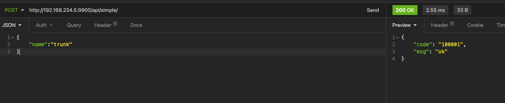
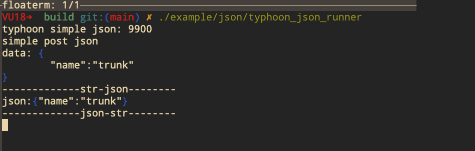

[TOC]

# Typhoon

> C++ web server 

## #1 环境 

```shell
Ubuntu 
macOS 
```

## #2 安装 


```shell
mkdir build && cd build
cmake ..
make 
sudo make install
```

## #3 快速开始 

```txt
find_package(PkgConfig REQUIRED)
pkg_check_modules(Typhoon REQUIRED typhoon)
include_directories(
    ${Typhoon_INCLUDE_DIRS}
}

link_directories (
    ${Typhoon_LIBRARY_DIRS}
}
target_link_libraries(${TARGET_NAME}
  ${Typhoon_LIBRARIES}
)
```


### #3.1 http

```cpp
#include <iostream>
#include <memory>
#include <string>
#include "typhoon.h"

class MyApi1: public typhoon::RequestHandler {
public: 
  void Get(typhoon::Application* app, typhoon::Connection* conn) override {
    std::cout << "simple get" << std::endl; 
    Response(app, conn, "simple http get");
  }
  
  void Post(typhoon::Application* app, typhoon::Connection* conn) override {
    std::cout << "simple post" << std::endl; 
    auto data = GetRequestData(conn);
    std::cout << "data: " << data << std::endl;
    Response(app, conn, "simple http post");
  }

};

int main(int argc, char *argv[]) {
  typhoon::Options options;
  options.port = 9900;
  std::cout << "typhoon simple http: " << options.port << std::endl;
  typhoon::Server server(options);
  auto api = std::make_shared<MyApi1>();
  server.AddHandle("/api/simple/", api);
  server.Spin();
  return 0;
}

```

### #3.2 websocket

```cpp
#include <iostream>
#include <memory>
#include <string>
#include "typhoon.h"

class MyApi2: public typhoon::WebSocketHandler {
public:
  MyApi2(const std::string& name) : typhoon::WebSocketHandler(name) {}

  void Open() override {
    std::cout << "ws open" << std::endl;
  }
  
  void OnClose() override {
    std::cout << "ws close" << std::endl;
  }
  
  void OnPong() override {
    std::cout << "---- pong" << std::endl; 
  }

};

int main(int argc, char *argv[]) {
  typhoon::Options options;
  options.port = 9900;
  std::cout << "typhoon simple websocket: " << options.port << std::endl;
  options.websocket_ping_interval = 1000; // 定时向客户端发ping帧. 回调OnPong()  
  typhoon::Server server(options);
  auto ws = std::make_shared<MyApi2>("simple");
  server.AddHandle("/api/ws/", ws);
  server.Spin();
  return 0;
}

```


### #3.3 json 

> 依赖`nlohmannjson`: https://github.com/nlohmann/json

```cpp
#include <iostream>
#include <memory>
#include <string>
#include "typhoon.h"
#include <nlohmann/json.hpp>

class MyApi1: public typhoon::RequestHandler {
public: 
  void Get(typhoon::Application* app, typhoon::Connection* conn) override {
    std::cout << "simple get" << std::endl; 
    Response(app, conn, "simple http get");
  }
  
  void Post(typhoon::Application* app, typhoon::Connection* conn) override {
    std::cout << "simple post json" << std::endl; 
    auto data = GetRequestData(conn);
    std::cout << "data: " << data << std::endl;

    std::cout << "-------------str-json--------" << std::endl;
    nlohmann::json obj = nlohmann::json::parse(data);
    std::cout << "json:" << obj << std::endl;

    std::cout << "-------------json-str--------" << std::endl;
    nlohmann::json ret;
    ret["code"] = "100001";
    ret["msg"] = "ok";
    std::string s = ret.dump(0);
    Response(app, conn, s);
  }

};

int main(int argc, char *argv[]) {
  typhoon::Options options;
  options.port = 9900;
  std::cout << "typhoon simple json: " << options.port << std::endl;
  typhoon::Server server(options);
  auto api = std::make_shared<MyApi1>();
  server.AddHandle("/api/simple/", api);
  server.Spin();
  return 0;
}

```





